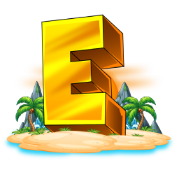

<div align="center">



# Geoventure Launcher

**Launcher Minecraft 1.20.1 — Geoventure MC**

[](https://github.com/Geoventure-MC/Launcher/releases)
[](https://minecraft.net)
[](https://electronjs.org)
[](LICENSE.md)
[](https://github.com/Geoventure-MC/Launcher/actions)

[Télécharger](#-téléchargement) · [Documentation](docs/README.md) · [Primer](primer.md) · [Discord](https://discord.gg/VCmNXHvf77)

</div>

---

## Présentation

Le **Geoventure Launcher** est un launcher Minecraft desktop multiplateforme construit avec [Electron](https://electronjs.org). Il se synchronise avec votre backend [Azuriom](https://azuriom.com) pour gérer l'authentification, les mods, les mises à jour et la configuration — sans avoir à recompiler le launcher à chaque changement.

> Conçu pour Minecraft **1.20.1** avec support Forge intégré.

---

## Fonctionnalités

| Catégorie | Détails |
|---|---|
| **Auth** | Azuriom Auth API (offline — pas de compte Microsoft requis) |
| **Mods** | Téléchargement automatique Forge / Fabric, mods optionnels |
| **UI** | Couleur principale personnalisable, thème sombre/clair |
| **Joueur** | Affichage skin 3D, grade, monnaie boutique |
| **Serveur** | Statut en temps réel (online/offline + joueurs connectés) |
| **News** | Flux RSS intégré depuis Azuriom |
| **Discord** | Rich Presence automatique |
| **RAM** | Configuration MIN/MAX RAM par défaut |
| **Whitelist** | Par utilisateur et/ou grade |
| **Maintenance** | Mode maintenance complet |
| **Langues** | FR, EN, DE, ES, RU (auto-détection système) |
| **Updates** | Auto-update via GitHub Releases |

---

## Téléchargement

Télécharge la dernière version depuis les [Releases GitHub](https://github.com/Geoventure-MC/Launcher/releases/latest).

| Plateforme | Fichier |
|---|---|
| Windows | `Conflictura Launcher-win-x64.exe` |
| macOS | `Conflictura Launcher-mac-universal.dmg` |
| Linux | `Conflictura Launcher-linux-x64.AppImage` |

---

## Développement

### Prérequis

- Node.js 22+
- npm 10+
- Python 3.x (pour les modules natifs)

### Installation

```bash
git clone https://github.com/Geoventure-MC/Launcher.git
cd Launcher
npm install
```

### Lancer en développement

```bash
npm start          # Mode dev (hot-reload désactivé)
npm run dev        # Mode dev avec hot-reload (nodemon)
```

### Build de production

```bash
npm run build      # Build + obfuscation pour la plateforme courante
```

Les artefacts sont générés dans le dossier `dist/`.

### Mettre à jour l'icône

```bash
npm run icon       # Télécharge et génère les icônes depuis l'URL configurée
```

---

## Configuration

La configuration est chargée dynamiquement depuis ton backend Azuriom :

```
{settings_url}/api/centralcorp/options
```

Modifie `package.json` pour pointer vers ton serveur :

```json
{
  "settings": "https://ton-serveur.fr"
}
```

Pour la doc complète de configuration : [docs/README.md](docs/README.md)

---

## Déploiement

Le CI/CD GitHub Actions publie automatiquement une release quand tu push sur `main`.

Voir [.github/workflows/ci.yml](.github/workflows/ci.yml) et [primer.md](primer.md) pour les détails.

---

## Fichiers de référence

| Fichier | Rôle |
|---|---|
| [primer.md](primer.md) | Architecture & guide de démarrage rapide |
| [memory.sh](memory.sh) | Script de capture du contexte projet |
| [hindsight.md](hindsight.md) | Retrospective & décisions techniques |
| [coffre.md](coffre.md) | Index Obsidian du projet |
| [docs/README.md](docs/README.md) | Documentation complète (EN/FR) |

---

## Licence

Ce projet est sous licence [CC BY-NC 4.0](LICENSE.md).  
Usage commercial interdit sans autorisation explicite.

---

<div align="center">
Fait avec ❤️ pour <strong>Geoventure MC</strong> · Minecraft 1.20.1
</div>
